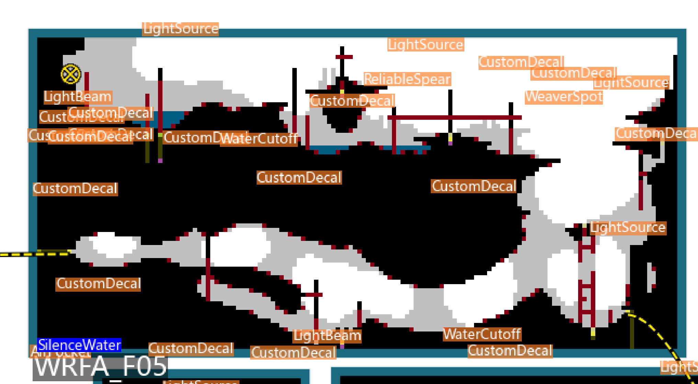
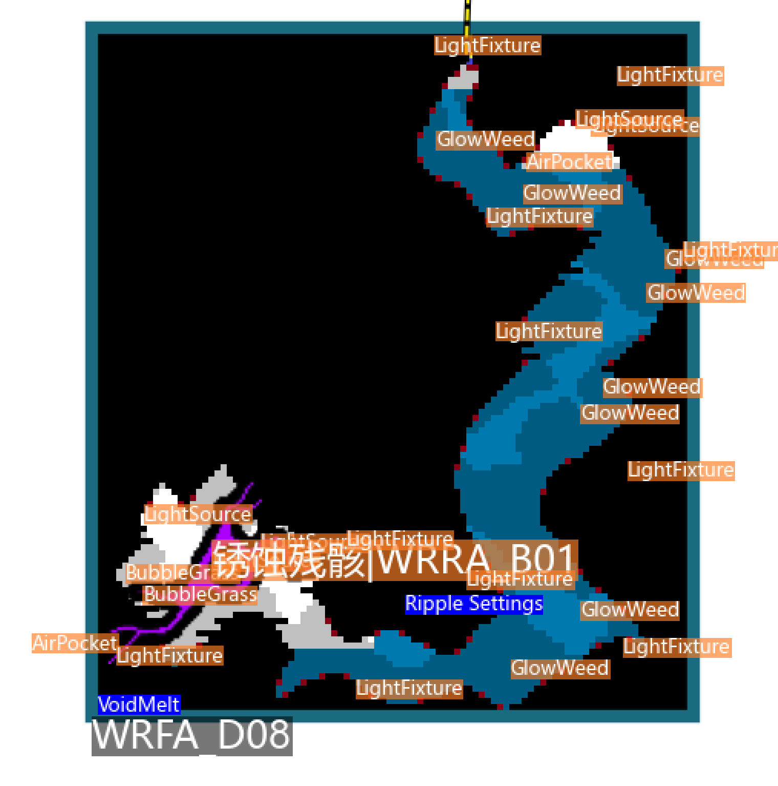

> [!NOTE]
>
> You may need to open `issues` on github.

## There are some issues

`WaterCutoff` and `AirPocket` can affect water distribution in map.

> [RoomInfo.water_mask](https://github.com/IceTiki/rainworld_zhiqiong/blob/4976472a4673fe371930a0b8bfc7da705ef9d8f6/assets.py#L793)
>
> ---
>
> Examples
>
> `WaterCutoff><861.1994><973.6594><1084.751~0~30~30~Y`
>
> clean all the water in X = `861.1994/20`~`861.1994/20 + 1084.751/20`, Y = `973.6594/20`~`INF`
>
> ---
>
> `AirPocket><-15.4426><-8.683811><2132.758~669.8554~-292.2666~269.1991~N~44.9745`
>
> clean all the water in X = `-15.4426/20`~`-15.4426/20 + 2132.758/20`, Y = `-8.683811/20`~`-8.683811/20 + 669.8554/20`

